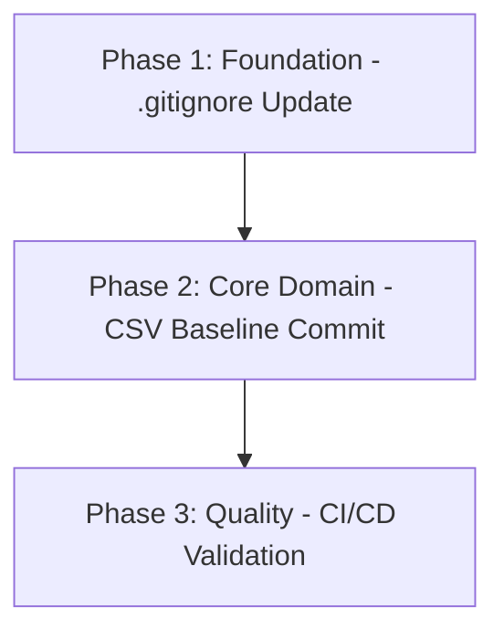

# Implementation Plan: F1 Data Sync Patch

## Plan Overview
This plan implements a persistent historical baseline by unignoring and committing `data/historical_data.csv` to the Git repository. This ensures that the GitHub Actions CI/CD environment always has access to the 2020-2024 data, even when API limits are reached.

- **Total Phases**: 3
- **Total Agents**: 2 (Coder, DevOps Engineer)
- **Estimated Effort**: Low (1-2 hours)

## Dependency Graph

## Execution Strategy
| Phase | Objective | Agent | Mode |
|-------|-----------|-------|------|
| 1 | Unignore historical CSV | Coder | Sequential |
| 2 | Commit local CSV to remote | Coder | Sequential |
| 3 | Verify GitHub Action run | DevOps Engineer | Sequential |

## Phase Details

### Phase 1: Foundation - .gitignore Update
- **Objective**: Modify `.gitignore` to allow `data/historical_data.csv` while still ignoring other data files.
- **Agent Assignment**: `coder` (Standard file modification)
- **Files to Modify**:
    - `.gitignore`: Remove/modify `data/*` to allow the specific CSV file.
- **Implementation Details**:
    - Change `data/*` to `data/*` + `!data/historical_data.csv` (or similar).
- **Validation Criteria**:
    - `git check-ignore data/historical_data.csv` returns non-zero (not ignored).
- **Dependencies**: None.

### Phase 2: Core Domain - CSV Baseline Commit
- **Objective**: Stage and commit the existing `data/historical_data.csv` to the main branch.
- **Agent Assignment**: `coder` (Git operations)
- **Files to Modify**:
    - `data/historical_data.csv`: No content change, just staging.
- **Implementation Details**:
    - `git add data/historical_data.csv`
    - `git commit -m "data: add 2020-2024 historical baseline to bypass API limits"`
- **Validation Criteria**:
    - `git ls-files data/historical_data.csv` shows the file is tracked.
- **Dependencies**: `blocked_by: [1]`

### Phase 3: Quality - CI/CD Validation
- **Objective**: Push changes to GitHub and verify that the GitHub Action successfully loads the CSV and completes model training.
- **Agent Assignment**: `devops_engineer` (CI/CD monitoring)
- **Implementation Details**:
    - `git push origin main`
    - Monitor GitHub Action run.
- **Validation Criteria**:
    - GitHub Action log shows `Loading historical data from data/historical_data.csv`.
    - Workflow finishes with success.
- **Dependencies**: `blocked_by: [2]`

## File Inventory
| File Path | Phase | Purpose |
|-----------|-------|---------|
| `.gitignore` | 1 | Unignore baseline CSV |
| `data/historical_data.csv` | 2 | Provide historical baseline to CI |

## Execution Profile
- Total phases: 3
- Parallelizable phases: 0
- Sequential-only phases: 3
- Estimated sequential wall time: 10-15 minutes

## Cost Estimation
| Phase | Agent | Model | Est. Input | Est. Output | Est. Cost |
|-------|-------|-------|-----------|------------|----------|
| 1 | coder | flash | 1K | 0.5K | $0.01 |
| 2 | coder | flash | 1K | 0.5K | $0.01 |
| 3 | devops_engineer | flash | 2K | 1K | $0.02 |
| **Total** | | | **4K** | **2K** | **$0.04** |
