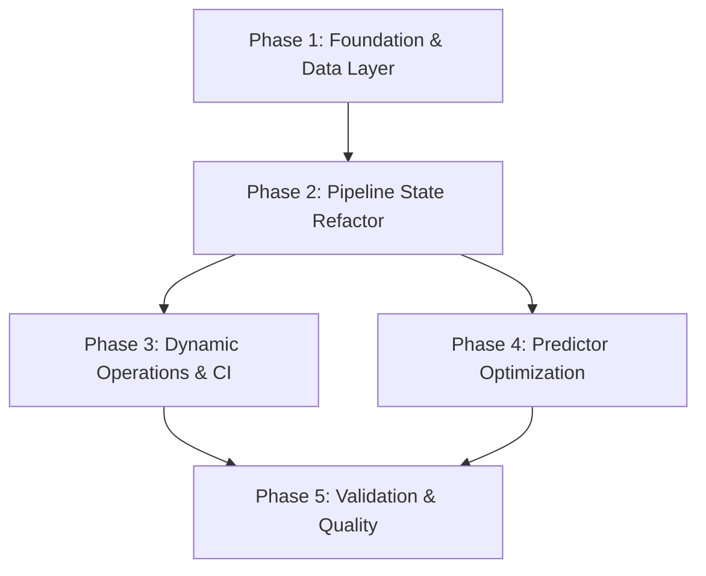

# Implementation Plan: F1 Predictor Dynamic Context & Robustness

**Date**: 2026-03-18
**Project**: f1-predictor
**Objective**: Fix the stale cache bug, automate fine-tuning/CI, and optimize inference performance.

## 1. Plan Overview
- **Total Phases**: 5
- **Agents Involved**: Coder, DevOps Engineer, Tester, Code Reviewer
- **Execution Mode**: Mixed (Sequential for core changes, Parallel for automation/docs)

## 2. Dependency Graph

## 3. Execution Strategy Table
| Phase | Agent | Scope | Execution Mode | Risk |
|-------|-------|-------|----------------|------|
| 1 | Coder | `data_fetcher.py`, `pyproject.toml` | Sequential | Low |
| 2 | Coder | `preprocessor.py`, `model.py` | Sequential | Medium |
| 3 | DevOps Engineer | `fine_tune.py`, `f1-prediction.yml` | Parallel | Medium |
| 4 | Coder | `predictor.py` | Parallel | Low |
| 5 | Tester | `tests/`, Final Review | Sequential | Low |

## 4. Phase Details

### Phase 1: Foundation & Data Layer
- **Objective**: Resolve the stale cache bug and update project metadata.
- **Agent**: Coder
- **Files to Modify**:
  - `src/f1_predictor/data_fetcher.py`: 
    - Update `fetch_historical_data` to generate filenames using `{start}_{end}` suffix.
    - Ensure new fetches are triggered if the specific range file is missing.
  - `pyproject.toml`: Add `license = {text = "MIT"}` to the `[project]` section.
- **Validation**: 
  - Call `fetch_historical_data(2020, 2024)` then `fetch_historical_data(2020, 2025)`.
  - Verify two distinct CSV files exist in `data/`.

### Phase 2: Pipeline State Refactor
- **Objective**: Enable `ModelPipeline` to store pre-calculated stats for inference.
- **Agent**: Coder
- **Files to Modify**:
  - `src/f1_predictor/preprocessor.py`:
    - Modify `FeatureProcessor.fit()` to return or store its baseline stats (driver/team means).
    - Update `transform_for_prediction` to accept these stats as an argument.
  - `src/f1_predictor/model.py`:
    - Update `ModelPipeline` `__init__` and `save/load` to handle the new `baselines` attribute.
- **Validation**: Run a dummy training script and verify the saved `.joblib` contains the `baselines` dictionary.

### Phase 3: Dynamic Operations & CI
- **Objective**: Automate round detection and clean up CI/CD hardcoding.
- **Agent**: DevOps Engineer
- **Files to Modify**:
  - `scripts/fine_tune.py`: 
    - Replace hardcoded `rounds=[1, 2]` with a function that queries `fastf1.get_event_schedule()`.
    - Filter rounds where the race session date is in the past.
  - `.github/workflows/f1-prediction.yml`: Remove `--predict 3 --year 2026` arguments from the prediction step.
- **Validation**: Run `fine_tune.py` and verify it attempts to fetch data for all completed 2026 rounds.

### Phase 4: Predictor Optimization
- **Objective**: Simplify inference and eliminate redundant data loads.
- **Agent**: Coder
- **Files to Modify**:
  - `src/f1_predictor/predictor.py`:
    - Update `predict_upcoming_race` to use `pipeline.baselines`.
    - Remove the `fetch_historical_data` call from the inference path.
- **Validation**: Run `f1-predictor --predict 1 --year 2025` and verify it executes successfully without loading `historical_data.csv`.

### Phase 5: Validation & Quality
- **Objective**: Ensure all changes meet quality standards and address review findings.
- **Agent**: Tester, Code Reviewer
- **Files to Modify**:
  - `tests/test_feature_processor.py`: Update tests to match the new `baselines` passing pattern.
- **Validation**: 
  - `pytest` passes all tests.
  - Standalone `code_reviewer` pass confirms all 5 findings are resolved.

## 5. Token Budget & Cost Summary
| Phase | Agent | Model | Est. Input | Est. Output | Est. Cost |
|-------|-------|-------|-----------|------------|----------|
| 1 | Coder | Pro | 5K | 1K | $0.09 |
| 2 | Coder | Pro | 8K | 2K | $0.16 |
| 3 | DevOps Engineer | Flash | 10K | 2K | $0.02 |
| 4 | Coder | Pro | 8K | 2K | $0.16 |
| 5 | Tester | Pro | 10K | 2K | $0.18 |
| **Total** | | | **41K** | **9K** | **$0.61** |

## 6. Execution Profile
- **Total phases**: 5
- **Parallelizable phases**: 2 (Phase 3 & 4)
- **Sequential-only phases**: 3
- **Estimated wall time**: 30-45 minutes

Note: Parallel dispatch runs agents in autonomous mode (--approval-mode=yolo).
All tool calls are auto-approved without user confirmation.
