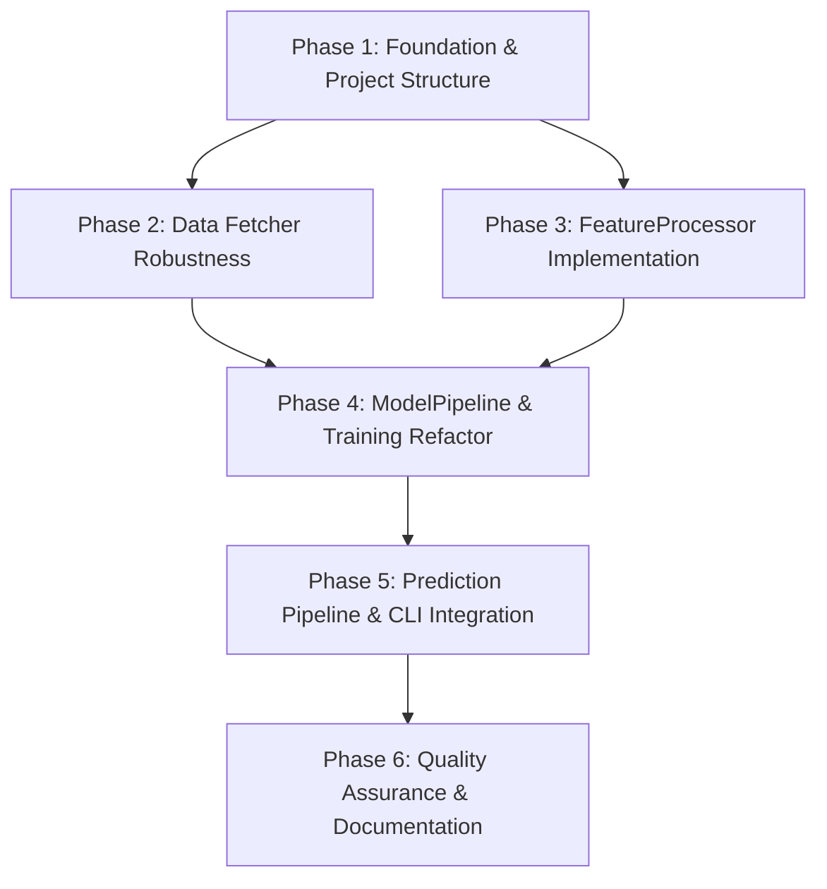

# Implementation Plan: F1 Predictor Pipeline Refactor

**Date**: 2026-03-18
**Project**: f1-predictor
**Objective**: Refactor the ML pipeline to eliminate data leakage, ensure feature consistency, and modernize the project structure.

## 1. Plan Overview
- **Total Phases**: 6
- **Agents Involved**: Architect, Coder, Tester, DevOps Engineer, Technical Writer
- **Execution Mode**: Mixed (Sequential for foundation, Parallel for implementation/testing)

## 2. Dependency Graph

## 3. Execution Strategy Table
| Phase | Agent | Scope | Execution Mode | Risk |
|-------|-------|-------|----------------|------|
| 1 | DevOps Engineer | `pyproject.toml`, Project Structure | Sequential | Low |
| 2 | Coder | `data_fetcher.py` (Retry/Cache) | Parallel | Low |
| 3 | Coder | `preprocessor.py` (FeatureProcessor) | Parallel | High |
| 4 | Coder | `model.py` (ModelPipeline) | Sequential | Medium |
| 5 | Coder | `predictor.py` (CLI & Inference) | Sequential | Medium |
| 6 | Tester | `tests/`, `README.md` | Parallel | Low |

## 4. Phase Details

### Phase 1: Foundation & Project Structure
- **Objective**: Modernize project structure and dependency management.
- **Agent**: DevOps Engineer
- **Files to Create**:
  - `pyproject.toml`: Define build system, dependencies, and `f1-predictor` entry point.
- **Files to Modify**:
  - `main.py`: Remove manual `sys.path` logic; transition to a thin wrapper for the CLI.
- **Validation**: `pip install -e .` followed by `f1-predictor --help`.

### Phase 2: Data Fetcher Robustness
- **Objective**: Implement retry logic and enhance caching for FastF1 API calls.
- **Agent**: Coder
- **Files to Modify**:
  - `src/f1_predictor/data_fetcher.py`: Add `@retry` decorator and update `fastf1` caching.
- **Validation**: Run `pytest tests/test_data_fetcher.py`.

### Phase 3: FeatureProcessor Implementation
- **Objective**: Centralize feature logic and eliminate data leakage.
- **Agent**: Coder
- **Files to Modify**:
  - `src/f1_predictor/preprocessor.py`: Implement the stateful `FeatureProcessor` class.
- **Implementation Details**:
  - `FeatureProcessor.fit()`: Store driver/team/event means and fit encoders.
  - `FeatureProcessor.transform()`: Implement strictly temporal shifts for rolling/expanding averages.
- **Validation**: Verify zero leakage via a script checking for future-info in features.

### Phase 4: ModelPipeline & Training Refactor
- **Objective**: Unified storage for model and metadata.
- **Agent**: Coder
- **Files to Modify**:
  - `src/f1_predictor/model.py`: Implement `ModelPipeline` wrapper for `FeatureProcessor` + `XGBRegressor`.
- **Validation**: Train a model and verify `models/f1_pipeline.joblib` is created.

### Phase 5: Prediction Pipeline & CLI Integration
- **Objective**: Connect the refactored components to the CLI.
- **Agent**: Coder
- **Files to Modify**:
  - `src/f1_predictor/predictor.py`: Use `ModelPipeline` for inference; remove hardcoded values.
- **Validation**: Run `f1-predictor --predict` for the next race.

### Phase 6: Quality Assurance & Documentation
- **Objective**: Ensure project stability and clear usage guides.
- **Agent**: Tester, Technical Writer
- **Files to Modify**:
  - `tests/`: Expand test coverage for `FeatureProcessor` and `predictor.py`.
  - `README.md`: Update installation and usage instructions.
- **Validation**: `pytest` passes with >80% coverage.

## 5. File Inventory
| File | Phase | Responsibility |
|------|-------|----------------|
| `pyproject.toml` | 1 | Build system & entry points |
| `src/f1_predictor/data_fetcher.py` | 2 | Robust API interactions |
| `src/f1_predictor/preprocessor.py` | 3 | Unified feature engineering |
| `src/f1_predictor/model.py` | 4 | Unified model/meta storage |
| `src/f1_predictor/predictor.py` | 5 | Consistent inference & CLI |
| `tests/` | 6 | Comprehensive validation |

## 6. Execution Profile
- **Total phases**: 6
- **Parallelizable phases**: 2 (Phase 2 & 3, Phase 6)
- **Sequential-only phases**: 3
- **Estimated wall time**: 45-60 minutes (Sequential), 30-45 minutes (Parallel)

## 7. Token Budget & Cost Summary
| Phase | Agent | Model | Est. Input | Est. Output | Est. Cost |
|-------|-------|-------|-----------|------------|----------|
| 1 | DevOps Engineer | Flash | 5K | 1K | $0.01 |
| 2 | Coder | Pro | 10K | 2K | $0.18 |
| 3 | Coder | Pro | 15K | 4K | $0.31 |
| 4 | Coder | Pro | 10K | 2K | $0.18 |
| 5 | Coder | Pro | 15K | 4K | $0.31 |
| 6 | Tester | Pro | 20K | 5K | $0.40 |
| **Total** | | | **75K** | **18K** | **$1.39** |
