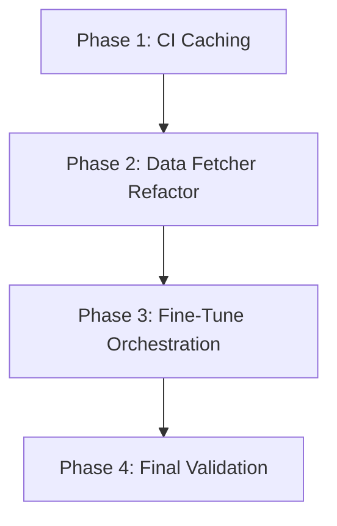

# Implementation Plan: GitHub Action API Limit Fix (Incremental Fetching & Caching)

## 1. Plan Overview
This plan implements a multi-layered solution to prevent API rate limit failures in the F1 Prediction GitHub Action. It combines GitHub Actions caching for FastF1 data with a refactored incremental data-fetching logic in Python.

- **Total Phases**: 4
- **Agents Involved**: `devops_engineer`, `data_engineer`, `tester`
- **Estimated Effort**: Medium

## 2. Dependency Graph

## 3. Execution Strategy Table

| Phase | Agent | Mode | Objective |
|---|---|---|---|
| 1 | `devops_engineer` | Sequential | Implement GitHub Actions caching for `data/cache`. |
| 2 | `data_engineer` | Sequential | Refactor `data_fetcher.py` for incremental history. |
| 3 | `data_engineer` | Sequential | Update `fine_tune.py` to use incremental fetching. |
| 4 | `tester` | Sequential | Verify caching and incremental logic end-to-end. |

## 4. Phase Details

### Phase 1: CI Caching
- **Objective**: Persist the `data/cache` directory between workflow runs using `actions/cache`.
- **Agent Assignment**: `devops_engineer` (expert in CI/CD and infrastructure).
- **Files to Modify**:
  - `.github/workflows/f1-prediction.yml`: Add a cache step immediately after `Set up Python`.
- **Implementation Details**:
  - Step Name: `Cache FastF1 data`
  - Key: `f1-data-cache-${{ runner.os }}-${{ hashFiles('requirements.txt', 'pyproject.toml') }}`
  - Path: `data/cache`
  - Restore-keys: `f1-data-cache-${{ runner.os }}-`
- **Validation Criteria**:
  - Workflow syntax check (`action-validator` or equivalent).
  - Verify cache key generation in logs.

### Phase 2: Data Fetcher Refactor
- **Objective**: Enable incremental data fetching by checking existing local data before requesting from API.
- **Agent Assignment**: `data_engineer` (expert in data pipelines and APIs).
- **Files to Modify**:
  - `src/f1_predictor/data_fetcher.py`:
    - Refactor `fetch_historical_data` to be additive. It should check for existing CSV files and only fetch missing years.
    - Implement checks in `fetch_season_data` to skip sessions already cached in `data/cache`.
- **Implementation Details**:
  - Use `os.path.exists()` to check for existing historical CSVs.
  - Implement logic to merge new results with existing ones without duplication.
- **Validation Criteria**:
  - Unit tests for `fetch_historical_data` mocking existing data.
  - Verify `data/cache` content structure.

### Phase 3: Fine-Tune Orchestration
- **Objective**: Coordinate the incremental fetch and model training process.
- **Agent Assignment**: `data_engineer` (expert in model training orchestration).
- **Files to Modify**:
  - `scripts/fine_tune.py`:
    - Refactor `get_completed_season_data` to only fetch rounds not already present in the local consolidated dataset.
    - Ensure `fine_tune()` only triggers training after a successful and verified data refresh.
- **Implementation Details**:
  - Compare round numbers in the current dataset with the official schedule.
  - Fail fast if data consolidation fails.
- **Validation Criteria**:
  - Local execution with simulated partial data.
  - Log verification of "Skipping Round X: Already exists".

### Phase 4: Final Validation
- **Objective**: Verify that the entire pipeline works efficiently and does not hit API limits.
- **Agent Assignment**: `tester` (expert in end-to-end verification).
- **Implementation Details**:
  - Simulate a second run where data is already in cache.
  - Verify that no API calls are made for cached data (using FastF1's verbose logging if possible).
- **Validation Criteria**:
  - Execution logs from `fine_tune.py` should show no new network activity for historical data.
  - Successful training of the model on the full, consolidated dataset.

## 5. File Inventory

| File Path | Phase | Purpose |
|---|---|---|
| `.github/workflows/f1-prediction.yml` | 1 | CI/CD pipeline definition. |
| `src/f1_predictor/data_fetcher.py` | 2 | Core data fetching and caching logic. |
| `scripts/fine_tune.py` | 3 | Model fine-tuning and data orchestration. |

## 6. Risk Classification

| Phase | Risk | Rationale |
|---|---|---|
| 1 | LOW | Standard GitHub Action practice. |
| 2 | MEDIUM | Complex logic needed to avoid data duplication during merges. |
| 3 | LOW | Straightforward orchestration changes. |
| 4 | LOW | Verification of the above phases. |

## 7. Execution Profile
- **Total phases**: 4
- **Parallelizable phases**: 0
- **Sequential-only phases**: 4
- **Estimated sequential wall time**: 15 minutes (CI execution time).

## 8. Plan-Level Cost Summary

| Phase | Agent | Model | Est. Input | Est. Output | Est. Cost |
|-------|-------|-------|-----------|------------|----------|
| 1 | `devops_engineer` | Pro | 3,000 | 500 | $0.05 |
| 2 | `data_engineer` | Pro | 4,000 | 1,500 | $0.10 |
| 3 | `data_engineer` | Pro | 3,000 | 1,000 | $0.07 |
| 4 | `tester` | Pro | 2,000 | 500 | $0.04 |
| **Total** | | | **12,000** | **3,500** | **$0.26** |
