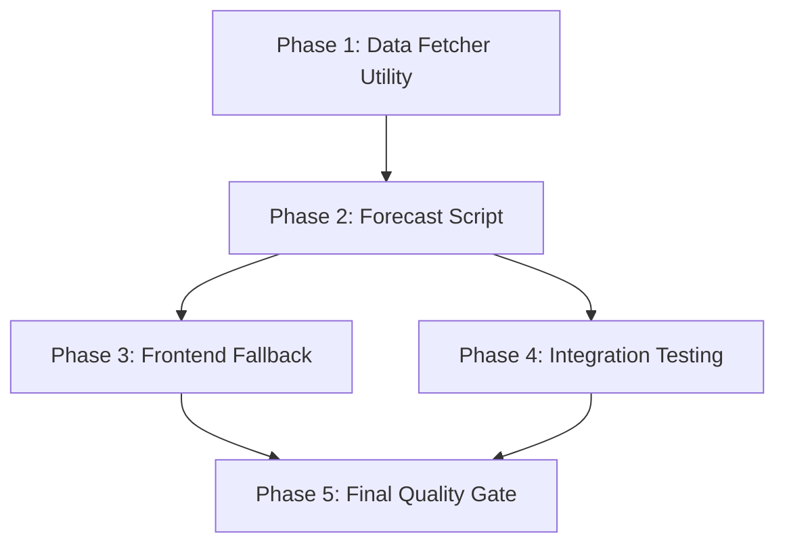

# Implementation Plan: 2026 F1 Standalone Forecast Script

## 1. Plan Overview
- **Total Phases**: 5
- **Agents Involved**: `data_engineer`, `coder`, `tester`, `code_reviewer`
- **Estimated Effort**: Medium

## 2. Dependency Graph

## 3. Execution Strategy Table
| Phase | Title | Agent | Parallel | Blocked By |
| :--- | :--- | :--- | :--- | :--- |
| 1 | Data Fetcher Utility | `data_engineer` | No | - |
| 2 | Forecast Script | `data_engineer` | No | 1 |
| 3 | Frontend Fallback | `coder` | Yes | 2 |
| 4 | Integration Testing | `tester` | Yes | 2 |
| 5 | Final Quality Gate | `code_reviewer` | No | 3, 4 |

## 4. Phase Details

### Phase 1: Data Fetcher Utility
- **Objective**: Add a utility function to fetch 2026-only statistics.
- **Agent**: `data_engineer`
- **Files to Modify**: `src/f1_predictor/data_fetcher.py`
- **Implementation Details**:
  - Implement `fetch_2026_stats()` that returns a DataFrame of 2026 results from FastF1.
  - Handle cases where no races have occurred yet (empty DF).
- **Validation**:
  - `python -c "from f1_predictor.data_fetcher import fetch_2026_stats; print(fetch_2026_stats())"`

### Phase 2: Forecast Script
- **Objective**: Create the standalone `forecast_2026.py` script.
- **Agent**: `data_engineer`
- **Files to Create**: `forecast_2026.py`
- **Implementation Details**:
  - Load the XGBoost model from `models/`.
  - Use `FeatureProcessor` from `preprocessor.py`.
  - Fetch 2026 stats using the utility from Phase 1.
  - Load `config/drivers_2026.json` for the current entry list.
  - Apply "Avg Quali" proxy: If no 2026 results exist, use `P20`.
  - Export to `website/forecast.json` with `is_preliminary: true`.
- **Validation**:
  - `python forecast_2026.py`
  - Verify `website/forecast.json` existence and format.

### Phase 3: Frontend Fallback
- **Agent**: `coder`
- **Files to Modify**: `website/index.html`
- **Implementation Details**:
  - Update `loadData()` to attempt `predictions.json` first.
  - If `predictions.json` is missing, stale (check race date), or fails, load `forecast.json`.
  - If `forecast.json` is loaded, display a "Forecast" or "Preliminary" tag in the UI header.
  - Ensure the "Cinematic Dark" aesthetic is maintained for the tag.
- **Validation**:
  - Rename `predictions.json` to `predictions.json.bak` and verify UI loads `forecast.json`.

### Phase 4: Integration Testing
- **Agent**: `tester`
- **Files to Create**: `tests/test_forecast_integration.py`
- **Implementation Details**:
  - Mock FastF1 API responses for 2026 stats.
  - Test `forecast_2026.py` with empty and non-empty 2026 stats.
  - Verify that `is_preliminary: true` is always present in the output.
- **Validation**:
  - `pytest tests/test_forecast_integration.py`

### Phase 5: Final Quality Gate
- **Agent**: `code_reviewer`
- **Objective**: Perform a final review of the new script, frontend changes, and tests.
- **Validation**:
  - Comprehensive review of all changed files.

## 5. File Inventory
| File | Phase | Agent | Purpose |
| :--- | :--- | :--- | :--- |
| `src/f1_predictor/data_fetcher.py` | 1 | `data_engineer` | Add 2026 stats utility |
| `forecast_2026.py` | 2 | `data_engineer` | Main forecasting script |
| `website/index.html` | 3 | `coder` | UI fallback and labeling |
| `tests/test_forecast_integration.py` | 4 | `tester` | Integration tests |

## 6. Risk Classification
| Phase | Risk | Rationale |
| :--- | :--- | :--- |
| 1 | LOW | Simple utility addition. |
| 2 | MEDIUM | Logic for grid proxies needs to be robust for season start. |
| 3 | LOW | Standard JS/HTML update. |
| 4 | LOW | Standard testing. |
| 5 | LOW | Review pass. |

## 7. Execution Profile
- **Total phases**: 5
- **Parallelizable phases**: 2 (Phase 3 & 4)
- **Sequential-only phases**: 3
- **Estimated parallel wall time**: ~15 mins
- **Estimated sequential wall time**: ~25 mins

Note: Parallel dispatch runs agents in autonomous mode.
