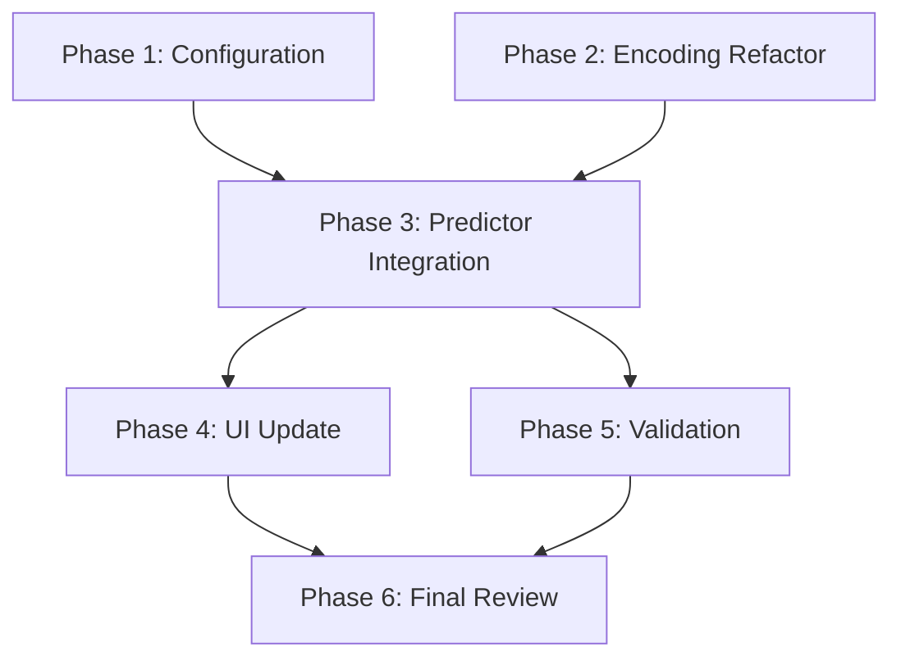

# Implementation Plan: 2026 F1 Predictor Pipeline Refactor

## Plan Overview
- **Total Phases**: 6
- **Total Agents**: 4
- **Estimated Effort**: Medium

## Dependency Graph

## Execution Strategy
| Phase | Stage | Agent | Mode |
|-------|-------|-------|------|
| 1 | Foundation | data_engineer | Sequential |
| 2 | Core | data_engineer | Sequential |
| 3 | Integration | coder | Sequential |
| 4 | Integration | coder | Parallel (with P5) |
| 5 | Quality | tester | Parallel (with P4) |
| 6 | Completion | code_reviewer | Sequential |

## Phase Details

### Phase 1: Configuration & Metadata
- **Objective**: Externalize 2026 driver/team metadata from code to config.
- **Agent**: `data_engineer`
- **Files to Create**:
  - `config/drivers_2026.json`: Contains mapping for all 22 2026 drivers (number, nationality, team).
- **Validation**:
  - Verify JSON schema and completeness against the 2026 grid list.

### Phase 2: Feature Encoding Refactor
- **Objective**: Upgrade `FeatureProcessor` to use `OrdinalEncoder` for robust unknown label handling.
- **Agent**: `data_engineer`
- **Files to Modify**:
  - `src/f1_predictor/preprocessor.py`:
    - Replace `LabelEncoder` imports with `sklearn.preprocessing.OrdinalEncoder`.
    - Update `fit()` to use `OrdinalEncoder(handle_unknown='use_encoded_value', unknown_value=-1)`.
    - Ensure `transform()` and `transform_for_prediction()` correctly handle the new encoding.
- **Validation**:
  - `pytest tests/test_preprocessor.py`
  - Manual check: feeding a new driver name should result in ID `-1` instead of `0`.

### Phase 3: Predictor Integration
- **Objective**: Update `predictor.py` to utilize the new encoding and externalized configuration.
- **Agent**: `coder`
- **Files to Modify**:
  - `src/f1_predictor/predictor.py`:
    - Remove hardcoded `lookup` dictionary.
    - Add logic to load `config/drivers_2026.json` during execution.
    - Ensure `export_json()` uses the loaded config for metadata.
- **Validation**:
  - `python main.py --predict 3 --year 2026` (Verify successful execution and `predictions.json` generation).

### Phase 4: UI Probabilistic Update
- **Objective**: Implement Gaussian win probability and complete the circuit map.
- **Agent**: `coder`
- **Files to Modify**:
  - `website/index.html`:
    - Replace `(100 - (driver.prediction * 5))` with `Math.exp(-Math.pow(driver.prediction - 1, 2) / (2 * 18.0)) * 100`.
    - Populate `circuitMap` with all 22 venues (Bahrain to Abu Dhabi).
- **Validation**:
  - Open `website/index.html` and verify P1 has a higher win probability than P4.
  - Verify circuit images load for various 2026 rounds.

### Phase 5: Validation & Testing
- **Objective**: Ensure the pipeline is stable and handles unknown data correctly.
- **Agent**: `tester`
- **Files to Create**:
  - `tests/test_encoding_stability.py`: Tests `FeatureProcessor` with unseen driver names and teams.
- **Validation**:
  - Run `pytest tests/test_encoding_stability.py`.

### Phase 6: Final Quality Gate
- **Objective**: Conduct final code review to ensure all 2026 fixes are correctly implemented.
- **Agent**: `code_reviewer`
- **Validation**:
  - Run `code_reviewer` on `src/`, `config/`, and `website/`.

## Execution Profile
- **Total phases**: 6
- **Parallelizable phases**: 2 (P4, P5)
- **Sequential-only phases**: 4
- **Estimated parallel wall time**: 15 mins
- **Estimated sequential wall time**: 25 mins

Note: Parallel dispatch runs agents in autonomous mode (--approval-mode=yolo).
All tool calls are auto-approved without user confirmation.

## Cost Estimation
| Phase | Agent | Model | Est. Input | Est. Output | Est. Cost |
|-------|-------|-------|-----------|------------|----------|
| 1 | data_engineer | Pro | 2K | 1K | $0.06 |
| 2 | data_engineer | Pro | 5K | 2K | $0.13 |
| 3 | coder | Pro | 8K | 3K | $0.20 |
| 4 | coder | Pro | 6K | 3K | $0.18 |
| 5 | tester | Pro | 4K | 2K | $0.12 |
| 6 | code_reviewer | Pro | 10K | 2K | $0.18 |
| **Total** | | | **35K** | **13K** | **$0.87** |
