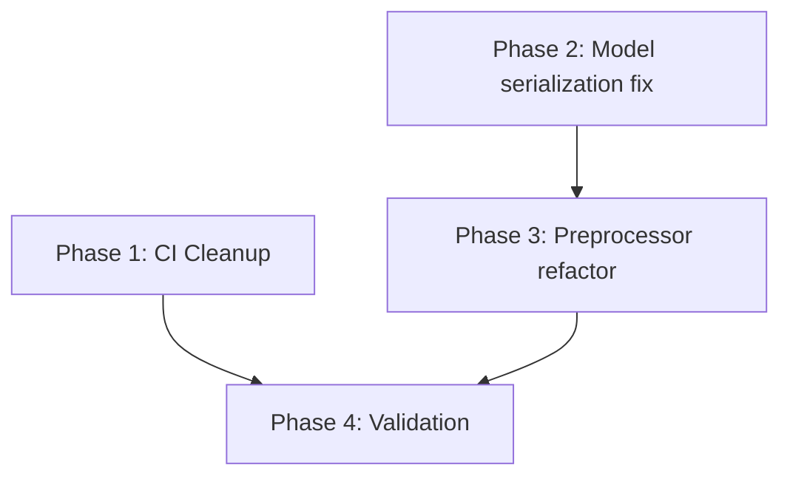

# Implementation Plan: F1 Predictor LSTM Fixes & CI Stabilization

**Task Complexity**: medium
**Status**: Pending Approval
**Design Depth**: deep

## 1. Plan Overview
This plan addresses technical regressions in the PyTorch LSTM migration, including 1-race feature lag, model loading mismatches, and CI environment stabilization.

- **Total Phases**: 4
- **Agents Involved**: `devops_engineer`, `refactor`, `tester`
- **Estimated Effort**: Medium

## 2. Dependency Graph

## 3. Execution Strategy Table
| Stage | Phases | Mode | Agents |
|-------|--------|------|--------|
| 1 | 1, 2 | Parallel | `devops_engineer`, `refactor` |
| 2 | 3 | Sequential | `refactor` |
| 3 | 4 | Sequential | `tester` |

## 4. Phase Details

### Phase 1: CI Cleanup & Foundation
- **Objective**: Purge `xgboost` from CI and fix LSTM dropout.
- **Agent**: `devops_engineer`
- **Rationale**: Requires both workflow configuration and minor model class adjustment.
- **Files to Modify**:
  - `.github/workflows/f1-prediction.yml`: Update cache key and add `pip uninstall -y xgboost`.
  - `src/f1_predictor/model.py`: Apply explicit dropout in `forward()`.
- **Implementation Details**:
  - Update YAML to ensure a fresh environment.
  - Move `self.dropout` call in `LSTMModel.forward` to be after the LSTM output but before `fc1`.
- **Validation**: `grep -r "xgboost" .` should show zero source matches. `pytest tests/test_preprocessor.py`.
- **Risk**: LOW

### Phase 2: Model Serialization Fix
- **Objective**: Enable dynamic hyperparameter loading in `ModelPipeline`.
- **Agent**: `refactor`
- **Rationale**: Requires structural changes to serialization logic.
- **Files to Modify**:
  - `src/f1_predictor/model.py`: Update `save` and `load` methods.
- **Implementation Details**:
  - `save()`: Include `hidden_size`, `num_layers`, and `dropout` in the `torch.save` dictionary.
  - `load()`: Extract these values from the checkpoint and pass them to the `LSTMModel` constructor. Use `.get(key, default)` for backward compatibility.
- **Validation**: Create a temporary script to train a model with `hidden_size=32`, save it, and load it to verify `model.hidden_size == 32`.
- **Risk**: LOW

### Phase 3: Preprocessor Refactor (Core Logic)
- **Objective**: Resolve 1-race feature lag in real-time predictions.
- **Agent**: `refactor`
- **Rationale**: Critical logic fix for prediction accuracy.
- **Files to Modify**:
  - `src/f1_predictor/preprocessor.py`: Update `_calculate_rolling_features` and `transform_for_prediction`.
- **Implementation Details**:
  - Add `shift_final_row=True` to `_calculate_rolling_features`.
  - In `transform_for_prediction`, ensure the *final* row of the sequence incorporates the most recent historical data without shifting it away.
- **Validation**: `pytest tests/test_feature_processor.py`. Add a specific test case checking that the last row of `X_pred` matches the last row of the input history (minus the shift).
- **Risk**: MEDIUM (potential for data leakage if not careful).

### Phase 4: Validation & Tuning
- **Objective**: Re-train model and verify R2 2026 performance.
- **Agent**: `tester`
- **Rationale**: End-to-end verification of fixes.
- **Files to Modify**:
  - `scripts/fine_tune.py`: Small adjustment to alignment check (Code Review Finding #3).
- **Implementation Details**:
  - Run `python3 scripts/fine_tune.py` to ensure it works on the new logic.
  - Verify that `website/predictions.json` is updated.
- **Validation**: `scripts/evaluate_model.py` output shows improved or stable metrics compared to previous runs.
- **Risk**: LOW

## 5. File Inventory
| Path | Phase | Action | Purpose |
|------|-------|--------|---------|
| `.github/workflows/f1-prediction.yml` | 1 | Modify | CI stabilization |
| `src/f1_predictor/model.py` | 1, 2 | Modify | Fix dropout and loading logic |
| `src/f1_predictor/preprocessor.py` | 3 | Modify | Resolve feature lag |
| `scripts/fine_tune.py` | 4 | Modify | Quality check alignment |

## 6. Token Budget & Cost Estimate
| Phase | Agent | Model | Est. Input | Est. Output | Est. Cost |
|-------|-------|-------|-----------|------------|----------|
| 1 | devops_engineer | Pro | 3,000 | 500 | $0.05 |
| 2 | refactor | Pro | 3,000 | 800 | $0.06 |
| 3 | refactor | Pro | 4,000 | 1,200 | $0.09 |
| 4 | tester | Pro | 5,000 | 1,000 | $0.09 |
| **Total** | | | **15,000** | **3,500** | **$0.29** |

## 7. Execution Profile
Execution Profile:
- Total phases: 4
- Parallelizable phases: 2 (Phase 1 and 2 in 1 batch)
- Sequential-only phases: 2
- Estimated parallel wall time: ~10 mins
- Estimated sequential wall time: ~15 mins

Note: Native parallel execution currently runs agents in autonomous mode.
All tool calls are auto-approved without user confirmation.
