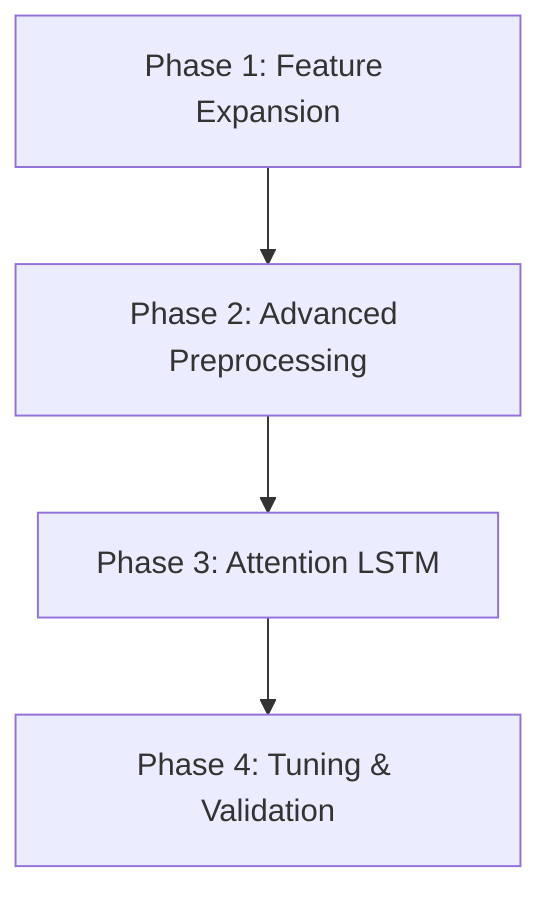

# Implementation Plan: F1 Predictor Accuracy Enhancements (v2.0)

**Task Complexity**: Medium
**Status**: Proposed
**Design Depth**: Deep

## 1. Plan Overview
This plan introduces a more granular feature set (qualifying deltas, reliability flags), data standardization, and an Attention-based LSTM architecture to improve F1 race predictions.

- **Total Phases**: 4
- **Agents Involved**: `data_engineer`, `refactor`, `coder`, `tester`
- **Estimated Effort**: Medium

## 2. Dependency Graph

## 3. Execution Strategy Table
| Stage | Phases | Mode | Agents |
|-------|--------|------|--------|
| 1 | 1 | Sequential | `data_engineer` |
| 2 | 2 | Sequential | `refactor` |
| 3 | 3 | Sequential | `coder` |
| 4 | 4 | Sequential | `tester` |

## 4. Phase Details

### Phase 1: Feature Expansion (Data Fetching)
- **Objective**: Extract granular qualifying pace and reliability data from FastF1.
- **Agent**: `data_engineer`
- **Files to Modify**: `src/f1_predictor/data_fetcher.py`
- **Details**:
  - Update `fetch_qualifying_results` to include `Q1`, `Q2`, `Q3` times.
  - Implement `calculate_q_delta` to find the percentage gap to the fastest lap in the session.
  - Ensure `fetch_race_results` properly captures the `Status` field.
- **Validation**: `python3 src/f1_predictor/data_fetcher.py` (Verify QDelta and Status are present in 2025 data).

### Phase 2: Advanced Preprocessing & Scaling
- **Objective**: Standardize input features and implement reliability flagging.
- **Agent**: `refactor`
- **Files to Modify**: `src/f1_predictor/preprocessor.py`
- **Details**:
  - Integrate `sklearn.preprocessing.StandardScaler`.
  - Add `is_mechanical_dnf` logic: map statuses like 'Engine', 'Gearbox', 'Electrical', 'Hydraulics' to 1, else 0.
  - Update `_calculate_rolling_features` to include `QDelta` and `is_mechanical_dnf`.
  - Refactor `transform` to support dynamic `time_steps`.
- **Validation**: `pytest tests/test_preprocessor.py` (Updated to check for scaled outputs).

### Phase 3: Attention-Augmented LSTM
- **Agent**: `coder`
- **Files to Modify**: `src/f1_predictor/model.py`
- **Details**:
  - Create `Attention` module: computes context vector from LSTM hidden states.
  - Update `LSTMModel`: Use all hidden states (`out`) as input to Attention layer.
  - Ensure `ModelPipeline` handles the increased feature count and scaling persistence.
- **Validation**: `python3 -m pytest tests/test_encoding_stability.py`.

### Phase 4: Hyperparameter Tuning & Verification
- **Agent**: `tester`
- **Files to Modify**: `scripts/fine_tune.py`
- **Details**:
  - Expand grid search to include `time_steps: [3, 5, 8, 10]`.
  - Run full tuning pipeline on 2020-2025 data.
  - Evaluate on 2026 R1-R2 and compare against the 5.05 MAE baseline.
- **Validation**: `python3 scripts/evaluate_model.py` (Verify MAE < 4.5).

## 5. Token Budget & Cost Estimate
| Phase | Agent | Model | Est. Input | Est. Output | Est. Cost |
|-------|-------|-------|-----------|------------|----------|
| 1 | data_engineer | Pro | 3,000 | 800 | $0.06 |
| 2 | refactor | Pro | 4,000 | 1,200 | $0.09 |
| 3 | coder | Pro | 4,000 | 1,500 | $0.10 |
| 4 | tester | Pro | 5,000 | 1,000 | $0.09 |
| **Total** | | | **16,000** | **4,500** | **$0.34** |

## 6. Execution Profile
Execution Profile:
- Total phases: 4
- Sequential phases: 4 (Dependencies are linear from data to training)
- Estimated sequential wall time: ~30 mins (includes data fetching and grid search).
